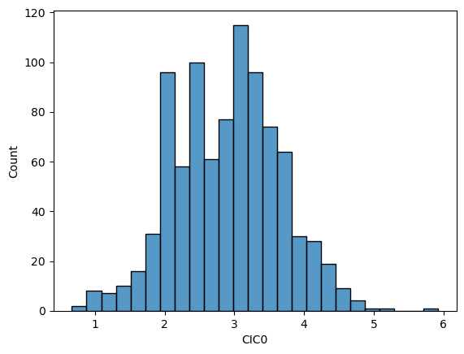
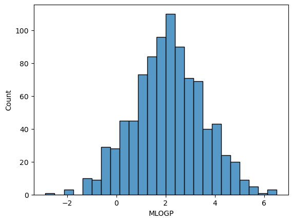
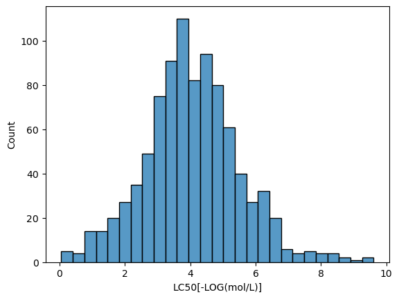

# Fathead Minnow Toxicity Analysis

# Summary

Within this project, I was tasked with choosing a dataset for linear regression. I then had to perform exploratory data analysis to examine the relationships between the different variables. Next, I examined for missing values and finally I scaled the dataset and performed linear regression modeling on the dataset. The dataset I chose was titled QSAR fish toxicity and it contained 6 features that were molecular descriptors of chemicals along with a target variable that represented toxicity towards the Fathead Minnow fish.

 
# Data
https://archive.ics.uci.edu/dataset/504/qsar+fish+toxicity

# Observations 
I selected a dataset that was used to develop quantitative regression QSAR models to predict toxicity in the Fathead Minnow fish.The dataset contains 908 rows which represent 908 different chemicals that may have an effect on the fish. The target,  LC50 [-LOG(mol/L)], represents the concentration or amount of the chemical that has a toxic effect on the Fathead Minnow.
The 6 features of the dataset were:
1) CIC0 - Information Indices
2) SM1_Dz(Z) - 2D Matrix based descriptors
3) GATS1i - 2D autocorrelations
4) NdsCH - atom type counts
5) NdssC - atom type counts
6) MLOGP - molecular properties

# EDA

In the 1st step, I conducted exploratory data analysis. I viewed the dataframe and used the describe method to view the tukey statistics on this dataframe. Then I conducted univariate analysis by generating visualizations to get an idea of any outliers and the distribution of the data. 

Out of the 6 features, CIC0 and MLOGP represent a normal distribution of the data

I also noticed that the label, LC50, shows a normal distribution as well

For the feature NdsCH, I observed that the atom type counts value with the largest count was 0.0, with a total count of larger than 700. Furthermore, in the NdssC feature, we can observe that the count of 0 has the largest amount of larger than 600.

# Data Cleaning and Transformation
In the next step, I was tasked with conducting data transformation and cleaning. I checked the dataframe for missing values using df.isna().sum(). The results showed me that there were no missing values in the dataframe. Since there were only 6 features, each of them will be neccesary for the model, so I do not need to remove any of them.Therefore I could move on to the next step in the process, modeling a linear regression model

# Linear Regression Modeling
Before modeling the data, I had to scale the data to make sure all data points were relative to the same range and scale. First, I split the dataset into X- the features and y- the label. Then I instantiated a standard scaler object and fit X- the features into it to scale the feature data. I confirmed that the dataset was ready for modeling by using X.head(50) and observing the values in the dataset. Using train_test_split I split the dataset into training and test sets, specifying a 25% split for the test set. Furthermore, I instantiated a linear regression model object and fit the training data to the model. I also set y_pred to equal the predictions on the test set. With model.score I found the R^2 value for the model, which is 0.57. This tells us that 57% of the variance in the target, LC50 [-LOG(mol/L)], can be explained by the model. Finally, I plotted the points of the test set and the regression line through the test sets as well as the test vs the predictions and the residual plot.

# Next Steps
Potential next steps for this dataset and model would be to gather more data on these 908 chemicals and identifying which specific components of the chemicals have certain effects on the toxicity level. For me personally, a goal or next step would be to conduct further research into this topic and gain a deeper understanding of the features and their meaning as well as more information on QSAR models.
